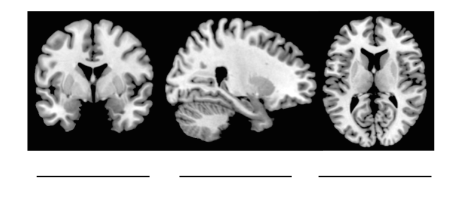

# Exam Title
Professor Fantastic  
February 23, 2017  

**ID:** ___________________________    **Date:** ____________________  *v123*

This exam has 6 questions. Make sure you complete every question. For multiple-choice questions, select the best answer. More than one may be somewhat correct, but one answer will be the “best” or most precise response to the question. For other questions, make sure to read the question closely. Some may ask for multiple pieces of information. Make sure to respond completely! Multiple-choice questions are worth two (2) points each, and true-false questions are worth one (1) point each. Other questions are graded as marked for a total of 17 possible points.

---

  
1. What part of the brain is necessary for long-term memory? 
 
  	A. orbitofrontal cortex  
  	B. primary visual cortex  
  	C. amygdala  
  	D. hippocampus  
  
2. Name the lobes of the brain. *(4 points)*  
  
3. *True or False:* The occipital lobe is important for olfaction.  	 Circle one: True / False  
  
4. Which of the following is not part of the brainstem? 
 
  	A. medulla  
  	B. pons  
  	C. midbrain  
  	D. putamen  
  
5. Label the brain slices. *(2 points)*  
  
  
6. Write everything you know about your favorite part of the brain.  *(6 points)*  
 
 END OF EXAM

